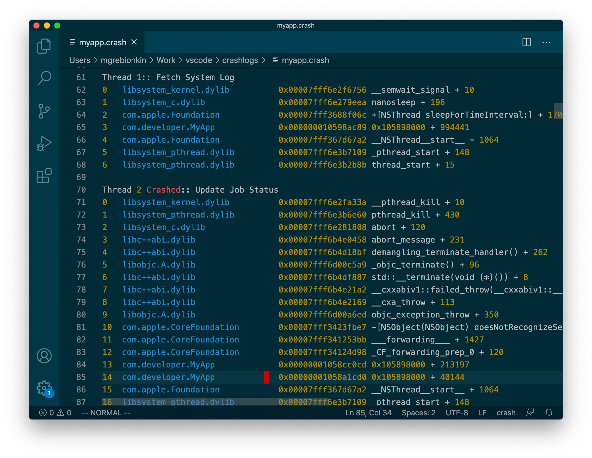

# Apple Crashlog

This extension provides basic highlighting for crashlogs in OSX operation system.

## Features

Extension highlights:

* numbers and memory addresses literals
* name of components, bundles
* paths to binary images

**Examples**:

## License

See more details in MIT [LICENSE.md](LICENSE)